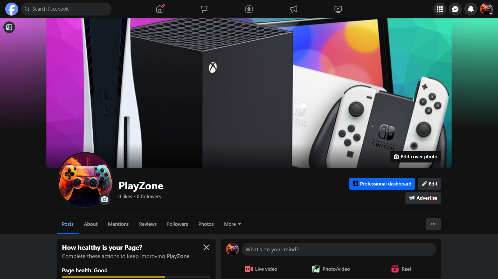

# PlayZone 

PlayZone is an online game store that offers a wide range of game genres and platforms, as well as game consoles. Our store ensures a smooth shopping experience with secure checkout, fast shipping, and special offers. It caters to gamers interested in the console gaming experience and want to stay updated with the latest games and consoles in the gaming industry. Additionally, our website features a section for upcoming games and consoles to keep you informed and prepared for new releases, and our content is updated regularly with what's in the gaming market. PlayZone is where your gaming journey begins and evolves – play more, pay less!

## Project goals
- __User goals__
    - To keep updated with the latest games and consoles in the gaming industry
    - To fulfill my passion for gaming and explore a wide range of game genres, and platforms , as well as game consoles
    - To purchase games and consoles I want to play
- __Site Owner goals__
    - To showcase a fullstack e-commerce web application that meets the assessment criteria
    - To develop my programming skills
    - To market and sell gaming products
    - To earn money and grow my company's profits

## User Experience

### User Category
- PlayZone is directed towards gaming enthusiasts who are mostly interested in console gaming experience. 

### User Expectations
- A website with smooth navigation, responsive design, and good accessibility
- A website that is visually appealing and well-designed
- To easily find the product or the information i am looking for
- An easy and secure authentication and registration process
- Various games with different genres and platforms and multiple game consoles on different platforms as well.
- Information about each game and console including product name, description, price, and more details
- A smooth shopping experience and secure checkout

### User Stories
#### Epic 1: Viewing and navigation
- Make the interface visually Appealing (MUST HAVE)
- Navigate easily between product categories(MUST HAVE)
- View a list of products(MUST HAVE)
- View product details(MUST HAVE)
- View all sorted products lists(MUST HAVE)
- Receive page load error Messages (MUST HAVE)
- Navigate to page about the website
- View the total of my purchases(SHOULD HAVE)
- View a list of upcoming games(COULD HAVE)
- View a list of Retro games(COULD HAVE)
- Arrange game events(WON'T HAVE)

#### Epic 2:Registration and User Accounts
- Register for an account(MUST HAVE)
- Log out of account (MUST HAVE)
- Log in to account(MUST HAVE)
- Recover password(MUST HAVE)
- Receive an email confirmation(MUST HAVE)
- Delete user account(SHOULD HAVE)
- Have a personalized user profile(SHOULD HAVE)
- Receive confirmation messages
- Full control over user accounts(WONT'T HAVE)

#### Epic 3: Sorting and Searching
- Search for a product(MUST HAVE)
- View search results(MUST HAVE)
- Sort products into categories(MUST HAVE)
- Sort all products list(SHOULD HAVE)
- Sort specific category of products(SHOULD HAVE)
- Filter Sorted category of products(COULD HAVE)

#### Epic 4: Purchasing and Checkout
- Select the quantity of the product(MUST HAVE)
- View items in my bag(MUST HAVE)
- Adjust the quantity of individual items(MUST HAVE)
- Enter payment information(MUST HAVE)
- Feel my personal and payment information is safe(MUST HAVE)
- View an order confirmation(MUST HAVE)
- Receive an order email confirmation(SHOULD HAVE)
- Cancel my order(WON'T HAVE)

#### Epic 5: Admin and Store Management
- Add a product(MUST HAVE)
- Update a product(MUST HAVE)
- Delete a product(MUST HAVE)
- Add game/console details
- Update game/console details
- Delete game/console details
- Receive confirmation messages for data management(SHOULD HAVE)
- Receive validation messages in forms(SHOULD HAVE)
- Track User Engagement and Analytics(WON'T HAVE)

#### Epic 6: User Interaction
- Subscribe to a newsletter(SHOULD HAVE)
- Leave a review on a product(SHOULD HAVE)
- Update a review(SHOULD HAVE)
- Delete a review(SHOULD HAVE)
- Send a message via contact form(SHOULD HAVE)
- Manage content items(WON'T HAVE)

## Database
### Database schema diagram

When creating the database structure schema for this project, I utilized the [drawsql.app](https://drawsql.app/) website. This online tool allowed me to visually design and document the database schema, making it easier to plan and implement the database for my e-commerce web application.

### Database schema Summary

### `User` Table
- Represents the basic user information according to Django's built-in User model.
- Fields: `user_id`, `username`, `email`, `password`.

### `Category` Table
- Stores the different categories that the superuser can select when creating a product.
- Fields: `category_id`, `name`, `friendly_name`.

### `Product` Table
- Stores products created by the superuser.
- Fields: `category`, `game`, `console`, `sku`, `name`, `description`, `price`, `rating`, `image_url`, `cover`.     

### `Platform` Table
- Stores the different platforms that the superuser can select when creating a game or a console.
- Fields: `platform_id`, `platform_name`.

### `Game` Table
- Stores game details created by the superuser for each game product.
- Fields: `game_id`, `title`, `slug`, `genre`, `description`, `platform`, `age_rating`, `developer`, `publisher`, `release`.

### `Console` Table
- Stores console specifications created by the superuser for each console product.
- Fields: `console_id`, `title`, `slug`, `developer`, `release`, `manufacturer`, `platform`, `processor`, `graphics`, `memory`, `storage`, `sound`, `mass`.            

### `Contact` Table
- Stores user information and message sent by the user to the administrator.
- Fields: `contact_id`, `name`, `email`, `phone`, `topic`, `message`, `upload `.

### `Order` Table
- Stores order information and details provided by the shopper.
- Fields: `order_number`, `full_name`, `email`, `phone_number`,`country`, `postcode`, `town_or_city`, `street_address1`,`street_address2`, `county`, `delivery_cost`, `order_total`,`grand_total`, `original_bag`, `stripe_pid`.

### `OrderLineItem` Table
- Stores information about a purchased product by the shopper.
- Fields:`order`, `product`, `quantity`, `lineitem_total`.

This database schema lays out the structure for the Play Zone application, giving an opportunity for gamers to easily keep updated with the latest games and consoles in the gaming industry.

## Design
### Color
### Typography
### Layout
### Wireframes

## Features
### Existing features

- **Landing page**
  - This page contains an advertisement message to attract customers and a call to action button `SHOP NOW` that takes the customer to all products list.

- **logo**
  - The logo is the store name and when clicked it takes you back to the landing page.

- **Navbar**
  - The navigation bar is visible on all pages and it contains links to all products lists in the site, a link to the store's official news site and a link to the contact us page.

- **View a list of products**
  - The customer can view a list a products. Each product card contains a picture, product name, price, category name and rating. 

- **Search for a product**
  - The shopper has access to a search bar to find any available products as long as the searched words match a word from the product name or description.

- **Sort products**
  - In the nav bar the shopper has access to a dropdown menu to sort all products by price, category and rating.

- **Filter products**
  - In the nav bar menu the shopper has access to two different drop down menu to filter both games and consoles based on brands (Xbox, Playstation and Nintendo)

- **Sort all products lists**
  - In all products lists both sorted and filtered, the shopper has access to a sorting list menu to sort lists by price(both directions), rating(both directions), name(alphabetically) and category(alphabetically).

- **View product details**
  - This page views the product image, name, price, rating, category name and description.
  - **View game details**: Below the product information, the shopper can view game details to read in case the product is a game.
  - **View console specs**: Below the product information, the shopper can view console specs to read in case the product is a console.

- **Modify quantity of product**
  - in the product details page the shopper has access to an input box to enter manually the quantity of the desired product. The shopper can also modify the quantity by using `+` and `-` buttons. 
  
- **Add item to bag**
  - From the post details page, the shopper has access to a button when clicked the product is added to the shopping bag, and a window to the top right corner will show and confirm this.

- **Shopping bag**
  - The shopping bag page is where the shopper can view items that were added to the bag. An order summary that provides information about each product: an image, product name, SKU number, price, quantity, the subtotal for each product and the total price of all products in the list. The shopper can modify the amount of each product or delete the product from the list. The page gives access to a `secure checkout` button to go to the next step.

- **Checkout**
  - In the checkout page, the shopper can view an order summary as previously named and have access to a form Where personal details, delivery and payment information can be filled in. Then the shopper can choose between going a step back to modify bag items or gå forward and complete the order.

- **Order confirmation**
  - After the order is completed and payment is successful, the shopper receives an order confirmation, which is also sent as an email confirmation. The shopper can be redirected to products list page using a button.

- **Add a product**
  - Admin have access to form in the website to create a new product. The added product will be seen in the products list page.

- **Update a product**
  - Admin can update a product from the products list page or product details page by accessing an `update` button. After update, the page will be redirected to the product details.

- **Delete a product**
  - Admin can delete a product from the products list page or product details page by accessing a `delete` button. After deletion, the page will be redirected to the products list.

- **Add game details**
  - Admin has access to form in the website to create a new game details that coordinates with the game product. The added game details will be seen in the product details page.

- **Update game details**
  - Admin can update game details for a game product from the product details page by accessing an `update` button in the game details card. After the update, Admin will be redirected the product details.
 
- **Delete game details**
  - Admin can delete game details for a game product from the product details page by accessing a `delete` button in the game details card. After the deletion, Admin will be redirected to the product details page with only product information.

- **Add console specs**
  - Admin has access to form in the website to create a new console specs that coordinates with the console product. The added console specs will be seen in the product details page.

- **Update console specs**
  - Admin can update console specs for a console product from the product details page by accessing an `update` button in the console specs card. After the update, Admin will be redirected the product details with only product information.

- **Delete console specs**
  - Admin can delete console specs for a console product from the product details page by accessing a `delete` button in the console specs card. After the deletion, Admin will be redirected to the product details page with only product information.

- **Contact us page**
  - Shoppers have access to a contact form where they can reach the administrator by leaving personal details and a message and choosing a topic.

- **Register an account**
  - Shoppers have access to a form so that they can register an account

  

- **log in an account**
  - Shoppers have access to a form so that they can log in to an accounts

  

- **log out of an account**
  - Shoppers can log out of an account

  

- **Newsletter: Mailchimp Integration**
  - The website integrates with Mailchimp, allowing users to subscribe to the newsletter. Users can fill in their email address, and a confirmation message will appear to acknowledge their subscription.

- **External links**
  - Linkedin link that takes the visitor to linkedin official site
  - Github link that takes the visitor to the project repository in github

- **messages**
  - The shopper can view a confirmation toast message when registering an account, loging in, loging out, adding items to bag and successful checkout.
  - Admin can view a confirmation toast message when adding product or game details or console specs, updating product or game details or console specs and deleting product or game details or console specs.

- **Error Pages**
  - The site contains custom error page for 404 errors.

  

### Privacy Policy
  - I generated it using [TermsFeed](https://www.termsfeed.com/privacy-policy-generator/ ). Not added to the website yet.

- **About us page**
  - This is not added yet. 

### Addtional features to implement

## Testing
### Code validation
#### Html validation
#### Css validation
#### Javascript validation
#### Python validation

### Manual testing
#### Security testing

Ensuring that users cannot access or modify content created by the superuser is crucial for maintaining the integrity and security of the application. The table demonstrates the application's robustness in handling unauthorized access attempts, ensuring user data security and integrity.

The following tests were conducted to verify that unauthorized access attempts are properly handled.

| Test Case | Description | Method | Expected Outcome | Actual Outcome | Result |
| --------- | ----------- | ------ | ---------------- | -------------- | --------- |
| Create Product Unauthorized Access | Non-admin attempting to create a product | Manual URL manipulation | The product creation form is unavailable | A message tells this feature is only available to superusers | ✅ |
| Edit Product Unauthorized Access | Non-admin attempting to edit a product | Manual URL manipulation | The edit form is unavailable | A message tells this feature is only available to superusers | ✅ |
| Delete Product Unauthorized Access | Non-admin attempting to delete a product | Manual URL manipulation | The adress non-functional | Redirect to products list page | ✅ |
| Create Game Unauthorized Access | Non-admin attempting to create a game | Manual URL manipulation | The game creation form is unavailable | A message tells this feature is only available to superusers | ✅ |
| Edit Game Unauthorized Access | Non-admin attempting to edit a game | Manual URL manipulation | The edit form is unavailable | A message tells this feature is only available to superusers | ✅ |
| Delete Game Unauthorized Access | Non-admin attempting to delete a game | Manual URL manipulation | The adress non-functional | Redirect to the correspondent product details page | ✅ |
| Create Console Unauthorized Access | Non-admin attempting to create a Console | Manual URL manipulation | The Console creation form is unavailable | A message tells this feature is only available to superusers | ✅ |
| Edit Console Unauthorized Access | Non-admin attempting to edit a Console | Manual URL manipulation | The edit form is unavailable | A message tells this feature is only available to superusers | ✅ |
| Delete Console Unauthorized Access | Non-admin attempting to delete a console | Manual URL manipulation | The adress non-functional | Redirect to the correspondent product details page | ✅ |
|

#### Element testing
- Clicked game and console external links. The result: Opens in a new tab. PASS 

**header**

- **`Not logged in user`**

| Feature | Expected Function | Testing Performed | Result | Pass/Fail |
| --- | --- | --- | --- | --- |
| Logo | Redirects to landing page | Clicked on logo | Home page loads | ✅ |
| All products | A dropdown menu will show up | Clicked on 'all products' menu| The dropdown menu is triggered | ✅ |
| Games | A dropdown menu will show up | Clicked on 'games' menu| The dropdown menu is triggered | ✅ |
| Consoles | A dropdown menu will show up | Clicked on the 'consoles' menu | The dropdown menu is triggered | ✅ |
| Account icon | A dropdown menu will show up | Clicked on the link icon 'Account' | The dropdown menu is triggered | ✅ |
| Bag icon | The bag page loads | Clicked on the link icon 'bag' | Redirected to bag page | ✅ |
| News | The store's official news site loads  | Clicked on the link 'news' | Redirected to the gaming news site | ✅ |
| Contact us | View a form to leave a message | Clicked on the link 'Contact us' | The user view a contact form to send a message | ✅ |
| Search bar | View search results | Added a search word and clicked on the search icon | search results show up | ✅ |
|

**header drop down menus**

- **`Not logged in user`**

| Feature | Expected Function | Testing Performed | Result | Pass/Fail |
| --- | --- | --- | --- | --- |
| Account icon | both register and login links takes you to correspondant pages| Clicked on both links | Both links takes you to correspondant pages | ✅ |
| All products | All links in the menu takes you to correspondant pages | Clicked on all 'all products' menu links| All products list and sorted products lists load | ✅ |
| Games | All links in the menu takes you to all filtered game products lists by category and all game products list | Clicked on all 'games' menu links| All links in the menu takes you to correspondant pages  | ✅ |
| Consoles | A dropdown menu will show up | Clicked on all 'consoles' menu links | All links in the menu takes you to all filtered console products lists by category and all console products list | ✅ |
|
&nbsp;
- **`Logged in as superuser`**

| Feature | Expected Function | Testing Performed | Pass/Fail |
| --- | --- | --- | --- |
| Account icon | All links add product, game, console and logout takes you to the correpondant pages | Clicked on all account menu links | ✅ |
|

&nbsp;

**footer**

| Feature | Expected Function | Testing Performed | Pass/Fail |
| --- | --- | --- | --- |
| Newsletter | The user can fill in an email and then receive a confirmation message for subscription | Filled in an email and clicked on the subscribe button | ✅ |
| Github link | when clicked it takes you the github project repository | Clicked on github link | ✅ |
| Linkedin link | when clicked it takes you the the linkedin official site | Clicked on linkedin link | ✅ |
|
&nbsp;

**Account Pages**

| Feature | Expected Function | Testing Performed | Pass/Fail |
| --- | --- | --- | --- |
| Register page | The user can view a regiter form and fill in an email, a username and a password and regsiter an acccount | Filled in all fields and clicked on the signup button | ✅ |
| login page | The user can view a login form and fill in a username and a password and login to account | Filled in a username and a password and clicked on the login button | ✅ |
| logout page | The user can view a logout page and has access to a logout button and logout  | Clicked on the logout button | ✅ |
|
&nbsp;

**Products list**
- **`Logged in as user/Not logged in`**

| Feature | Expected Function | Testing Performed | Pass/Fail |
| --- | --- | --- | --- |
| Product image link | When clicked it takes you to the product details page | Clicked on the image link | ✅ |
| Category link in each product card | When clicked it takes that specific category products list | Clicked on category link | ✅ |
| Sort drop down menu | View correspondant sorted lists with each 'sort by' option | Clicked on the logout button | ✅ |
|
&nbsp;

- **`Logged in as superuser`**

| Feature | Expected Function | Testing Performed | Pass/Fail |
| --- | --- | --- | --- |
| edit button | When clicked it takes you to the 'edit product' form page | Clicked on the 'update link' | ✅ |
| delete button | When clicked it deletes the product from the list | Clicked on the image 'delete' link | ✅ |
|
&nbsp;

**Product Details**

- **`Logged in as user/Not logged in`**

| Feature | Expected Function | Testing Performed | Pass/Fail |
| --- | --- | --- | --- |
| quantity input | The user can add manually the quantity of product | Added manually a number  | ✅ |
| '+' button | When clicked it increases the quantity of product | Clicked on the '+' button | ✅ |
| '-' button | When clicked it decreases the quantity of product | Clicked on the '-' button| ✅ |
| Category link | When clicked it takes you to that specific category products list | Clicked on category link | ✅ |
| 'Add to bag' | When clicked the selected quantity of the product is added to bag | Clicked on the 'add to bag' button | ✅ |
| 'keep shopping' button | When clicked it takes you to the products list | Clicked on the 'keep shopping' button | ✅ |
|
&nbsp;

- **`Logged in as superuser`**

| Feature | Expected Function | Testing Performed | Pass/Fail |
| --- | --- | --- | --- |
| edit button for product | When clicked it takes you to the 'edit product' form page | Clicked on the 'update product link' | ✅ |
| delete button for product | When clicked it deletes the product then redirected to the products list | Clicked on the image 'delete' link | ✅ |
| edit button for game | When clicked it takes you to the 'edit game' form page | Clicked on the 'update game link' | ✅ |
| delete button for game | When clicked it deletes the game then redirected to the products list | Clicked on the image 'delete game' link | ✅ |
| edit button for console | When clicked it takes you to the 'edit console' form page | Clicked on the 'update console link' | ✅ |
| delete button for console | When clicked it deletes the console then redirected to the correspondant product details | Clicked on the image 'delete' link | ✅ |
|
&nbsp;

**Add, edit and delete items**
- **`Logged in as superuser`**

| Feature | Expected Function | Testing Performed | Pass/Fail |
| --- | --- | --- | --- |
| Add product, game, console | Superuser has access to all 'Add item' forms, can fill in all fields with no validation errors and objects are created.  | Filled in all necessary fields and clicked on 'add object' buttton  | ✅ |
| Edit product, game, console | Superuser has access to all 'Edit item' forms, can modify selected fields with no validation errors and objects are updated.  | Made changes in all necessary fields and clicked on 'update object' buttton  | ✅ |
| Delete product, game, console | Superuser has access to all 'Delete item' buttons, can delete selected objects | clicked on 'delete object' buttton  | ✅ |
&nbsp;

**Send a message**

- **`Logged in as user/Not logged in`**

| Feature | Expected Function | Testing Performed | Pass/Fail |
| --- | --- | --- | --- |
| Send a message to the administrator | Users has access to contact form, can fill in all fields with no validation errors and receive a confirmation message that message is sent.  | Filled in all necessary fields in contact form and clicked on 'Send' button  | ✅ |
|
&nbsp;

**Shopping bag**

- **`Logged in as user/Not logged in`**

| Feature | Expected Function | Testing Performed | Pass/Fail |
| --- | --- | --- | --- |
| quantity input | The user can add manually the quantity of product | Added manually a number  | ✅ |
| '+' button | When clicked it increases the quantity of product | Clicked on the '+' button | ✅ |
| '-' button | When clicked it decreases the quantity of product | Clicked on the '-' button| ✅ |
| update button for product quantity | When clicked it updates the quantity of product  | Clicked on the 'update link' after changing quantity | ✅ |
| delete button for product quantity | When clicked it deletes the product from the shopping bag  | Clicked on the 'delete link' | ✅ |
| 'Secure checkout' button | When clicked it takes to the checkout page | Clicked on the 'Secure checkout' button | ✅ |
| 'keep shopping' button | When clicked it takes you to the products list | Clicked on the 'keep shopping' button | ✅ |
|
&nbsp;

**Checkout page**

- **`Logged in as user/Not logged in`**

| Feature | Expected Function | Testing Performed | Pass/Fail |
| --- | --- | --- | --- |
| checkout and payment forms | The form is filled with no validation errors | Added manually a number  | ✅ |
| 'Complete Order' button | When clicked it processes your order and you receive an order confirmation page and message | Clicked on the 'Complete Order' button | ✅ |
| 'Adjust bag' button | When clicked it takes you back to the shopping bag page | Clicked on the 'Adjust bag' button | ✅ |
|
&nbsp;

**Order confirmation page**

- **`Logged in as user/Not logged in`**

| Feature | Expected Function | Testing Performed | Pass/Fail |
| --- | --- | --- | --- |
| 'Go back to the store' button | redirects to products list page | Clicked on 'go back' button  | ✅ |
|
&nbsp;

### Responsivenss
- I used google chrome device toolbar in devtools to test responsiveness of my project in with different devices. `mobile devices`, `tablets`, `desktop` and `larger screens`.
## Technologies used
### Languages
- HTML5
- CSS3
- JavaScript
- Python

### Frameworks, libraries and other technologies
- Stripe
- heroku
- github
- git
- Code Institute Postgres Database server
- bootstrap 4.6
- asgiref==3.8.1
- cloudinary==1.36.0
- dj-database-url==0.5.0
- dj3-cloudinary-storage==0.0.6
- Django==4.2.16
- django-allauth==0.57.2
- django-countries==7.2.1
- django-crispy-forms==1.14.0
- gunicorn==20.1.0
- oauthlib==3.2.2
- pillow==11.0.0
- psycopg2==2.9.10
- PyJWT==2.9.0
- python3-openid==3.2.0
- requests-oauthlib==2.0.0
sqlparse==0.5.1
- stripe==11.2.0
- urllib3==1.26.20
- whitenoise==6.8.2

## Bugs
### Solved bugs
### Unsolved bugs

## Web Marketing

PlayZone stands as a B2C e-commerce platform, dedicated to gaming enthusiasts that are mostly interested in console gaming and want to keep updated with the latest gen of gaming hardware and software. 

### Key Advantages for PlayZone:
- Cost Efficiency: By offering products at near cost price, we ensure that our clients get deals and lower prices than other similar stores to gain loyal customers.
- Quick Delivery: Our efficient logistics ensure that products are delivered swiftly to reach our customers as early as possible and it's free when the customer reaches a certain amount.
- Diverse Product Range: We have wide range of games and consoles on different platforms.

### Marketing and Customer Engagement Strategies:
- In our store we added a newsletter that only requires from users to fill an email to make it easy for them to subscribe. By gaining more subscribers we can reach more people through email to advertise our products and let them know about our deals.

- Facebook Business Page: We want to interact with our audience, communicate product updates, and provide customer service by using Facebook's business features to build a thorough business page. Customers can reach us 

  Link to the Facebook Business Page [Here](https://www.facebook.com/profile.php?id=61569954351726)

- Community Building: By providing insightful advice through our content, and arranging gaming events to gather gamers, we hope to create a knowledgeable user base that will increase client loyalty and engagement.

- We have a contact form in our website to make it easy for customers to reach us for whatever topic or service thay may need.

### Site Features and User Experience:
PlayZone's user-friendly design includes a simplified purchasing procedure, committed customer service, and easy navigation. We want every visitor to be able to quickly locate their favorite games and systems and stay updated with the newest releases.

### Business model
### Marketing strategy

## Search Engine Optimization
SEO and Content Strategy: We aim to find and target important search terms related to our variety of latest gaming platforms and products using technologies like WordTracker and Google Trends.

### Keywords
Keywords is a fundamental key for our website to be ranked highly by google search. Keywords are a combination of short tail and long tail keywords.

- **Short tail keywords**
  - `Xbox series X games`
  - `Xbox series S games`
  - `PS5 games`
  - `Nintendo switch games`
  - `Latest games`
  - `Latest consoles`
  - `Xbox games`
  - `Playstation games`
  - `Nintendo games`
  - `Xbox consoles`
  - `Playstation consoles`
  - `Nintendo consoles`
  - `buy latest games`
  - `buy latest consoles`
  - `game store`

- **Long tail keywords**
  - `Buy PS5 games online`
  - `Buy Xbox series games online`
  - `Buy Nintendo Switch games online`
  - `Affordable Xbox Series X consoles`
  - `Best Nintendo Switch games for families`
  - `Newest video games for PS5`
  - `The best of latest gen games`
  - `The best of latest gen consoles`
  - `Top-rated Xbox Series X games`
  - `Where to buy gaming consoles online`
  - `New Nintendo Switch releases online`
  - `Latest Xbox Series X games`
  - `Game store that sells games and consoles`
  - `Good ideas for gifts to gamers`

### Robots.txt
- The robots.txt file was created and uploaded to the root directory of the site. This file tells search engines where they are not allowed to go on our website. The existence of this file is a sign of quality and therefore it improves SEO ranking.

### Sitemap.xml
- Sitemap was generated using [XML sitemaps](https://www.xml-sitemaps.com/) and uploaded to the root directory. This file lists a website’s  
important page urls, making sure that search engines can navigate through them. It also helps search engines understand your website structure.

### Content
- I used semantic elements in my project to keep a structure that is customized for SEO.
- I used keywords in headings and put them in strong tags to emphasize it's importance. 
- The project has internal links that leads to all pages to help users to continue exploring my site.
- I used external links for each product either a game or console that provides more information about the product and they link to official sites for Sony Playstation, Microsoft Xbox and Nintendo.

### Page titles
- For the home page i chose a document title that indicates the domain name and whay kind of products users will expect, The title is also customized to keywords for SEO purposes.
- I used different document titles when filtering games and consoles. 

## Deployment

**Create a new project:**
- Open your GitHub repository in a new IDE workspace.
- Use pip3 to install Django version ~=4.2.1 as it is the    
  long-term supported (LTS) version of the Django package at this moment. <mark>pip3 install Django~=4.2.1</mark>
- Freeze the packages to the requirements file using pip3.<mark>pip3 freeze local > requirements.txt</mark>
- Create a new project named codestar using the appropriate Django command with a dot at the end to signify the current directory level <mark>django-admin startproject codestar .</mark>
---
**Create a new app:**
- Create a new app named my_app using the appropriate Django command. <mark>python3 manage.py startapp my_app</mark>
- Add the new app to the list of installed apps in the settings.py file.
 
**Create the Heroku app:**
- Navigate to https://www.heroku.com
- Create an account and log in
- Navigate to your Heroku dashboard and create a new app with a unique name.
- Click on the Settings tab and reveal the config vars.
- Add a key of DISABLE_COLLECTSTATIC and a value of 1 and click Add.
- This step prevents Heroku from uploading static files, such as CSS and JS, during the build.
---
**Update your code for deployment:**
- Install a production-ready webserver for Heroku using the command <mark>pip3 install gunicorn~=20.1</mark>
- Add gunicorn==20.1.0 to the requirements.txt file using the command: <mark>pip3 freeze --local > requirements.txt</mark>
- Create a file named Procfile at the root directory of the project(same directory as requirements.txt).
- In the Procfile, declare this is a web process followed by the command <mark>web: gunicorn my_project.wsgi</mark> to execute your Django project and start the server.
   This assumes your project is named my_project.
- Open the my_project/settings.py file and replace DEBUG=True with DEBUG=False. and append the '.herokuapp.com' hostname to the ALLOWED_HOSTS list.
- Git add, commit, and push the code to your GitHub repo.
---
**Create PostgreSQL instance:**
- Navigate to [PostgreSQL from Code Institute](https://dbs.ci-dbs.net/)
- Enter your student email address in the input field provided
- Click Submit and wait while the database is created 
- When your database is successfully created, review the email sent to your student email inbox
---
**connect database to code:**
- Set back debug value to 'True' to ease debugging during development
- Create a file named env.py at the top level project using the command <mark>touch env.py</mark> in the terminal
- Open the .gitignore file and add env.py to prevent the secret data you will add to it from being pushed to GitHub
- In your newly created env.py file, import Python's operating system module using <mark>import os</mark> 
- Set the value of the DATABASE_URL constant to the URL in the email you received from PostgreSQL from Code Institute <mark>os.environ.setdefault("DATABASE_URL", "your-database-URL")</mark>
- Pip install the two packages required to connect to your PostgreSQL database using <mark>pip3 install dj-database-url~=0.5 psycopg2~=2.9</mark> command, then add them to the requirements file using <mark>pip3 freeze --local > requirements.txt</mark> command
- In my_project/settings.py, import the appropriate packages to connect the settings.py file to the env.py file by adding: 
<mark>import os 
import dj_database_url 
if os.path.isfile('env.py'):
    import env</mark>
- Next in the settings.py file, we need to comment out the local sqlite3 database connection.
- Then, in the settings.py file, connect to the environment variable DATABASE_URL you previously added to the env.py file by adding:  <mark>DATABASES = {
    'default': dj_database_url.parse(os.environ.get("DATABASE_URL"))
}</mark>
- Now that your project is connected to the database, you can create database tables with Django's migrate command <mark>python3 manage.py migrate</mark>
---

**Enter your first data in the database:**
- As Django comes with built-in auth and admin apps we can create a superuser with admin access to our database using the command:
<mark>python3 manage.py createsuperuser</mark>
Choose a memorable user name, use your email address and choose a secure password.
---

**Connect Heroku to PostgreSQL database:**
- Navigate to the Heroku dashboard and return to settings
- Click on <mark>Reveal Config Vars</mark> and add a new config var with a key of <mark>DATABASE_URL</mark>
- Assign to it a value of the URL you received in your email from the Code Institute Postgres Database Server and then click on <mark>Add</mark>
- Now your PostgreSQL cloud database is connected to your deployed app.
---
**Connect to Cloudianry API:**
- Install the Python packages required to connect to the Cloudinary API <mark>pip3 install cloudinary~=1.36.0 dj3-cloudinary-storage~=0.0.6 urllib3~=1.26.15</mark>
- Add these package versions to the requirements.txt file. <mark>pip3 freeze --local > requirements.txt</mark>
- Click the provided link to sign up for[Cloudinary](https://cloudinary.com/users/register_free)
- Provide your name and email address and choose a password or sign in with a social account. 
- If asked, How would you best describe yourself? you can click on Developer.
- Depending on your chosen sign-up method, you may have to respond to an email 
  verification. 
- In the Cloudinary dashboard, copy the CLOUDINARY_URL.
- Open the env.py file and set the value of the CLOUDINARY_URL constant to the URL you copied from the Cloudinary dashboard.
<mark>os.environ.setdefault("CLOUDINARY_URL", "URL copied from Cloudinary in last step")</mark>
- Delete the CLOUDINARY_URL= from the start of the URL string, as we are using the setdefault() method rather than assigning the value.
- Open the my_project/settings.py file and add the apps to INSTALLED_APPS, 'cloudinary_storage' and 'cloudinary'

**Update the blog app to use Cloudinary:**
- Open the app/models.py and import the CloudinaryField from the cloudinary/models.py file.
- Also, in the app/models.py file, add a new field to the specific model to store an image.
- As we have added a new model field, we must run makemigrations to create a new migrations file. <mark>python3 manage.py makemigrations</mark>
- Now, migrate the app migrations file to make the changes to the database schema. <mark>python3 manage.py migrate</mark>
---
**Deploy to Heroku:**
- Add the environment variable <mark>SECRET KEY</mark> to the Heroku app's config vars in the settings tab for security reasons.
- Link the secure key in env.py to the settings.py SECRET_KEY variable with the following code: <mark>SECRET_KEY = os.environ.get('SECRET_KEY')</mark>
- Set debug to <mark>FALSE</mark>
- Now, let's return to the Heroku dashboard, and in your app, click on the Deploy tab.
- In the Deployment method section enable GitHub integration by clicking on Connect to GitHub.
- Below you can search for your GitHub repo and connect it to the Heroku app.
- Scroll down and Manually deploy the main branch of this GitHub repo.
- In your new app’s resources tab, ensure you are using an eco dyno and delete any Postgres database Add-on.
- Click on <mark>Open app</mark> to open the rendered webpage(deployed project).
---

### Fork the Repository:
By forking the GitHub Repository, you can create a copy of the original repository without affecting the original. To implement that follow these steps below:

- Log into GitHub account or create one if you don't have one.
- Locate the Repository. Note! the repository is at https://github.com/programmer-1991/play-zone
- At the top right of the repository page, click "Fork" to create a copy in your own GitHub repository.
---

### Clone the Repository:
When you create a repository on GitHub.com, it exists as a remote repository. You can clone your repository to create a local copy on your computer and sync between the two locations. Creating a clone allows you to have a local copy of the project. Follow these steps:

- Navigate to https://github.com/programmer-1991/play-zone
- Click the green "Code" button at the top right.
- Select the "Clone by HTTPS" option and copy the web URL to the clipboard.
- Open your code editor or terminal and navigate to the directory where you want to clone the repository.
- Run `git clone` followed by the copied URL.
- Press enter, and Git will clone the repository to your local machine.

## Credits